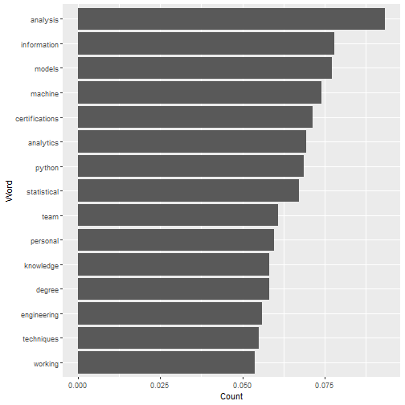

Data Science
========================================================
author: David Msote
date: 03/20/20
autosize: true

Data from Indeed
========================================================

We used a web scraper to collect data from Indeed.com on Data Science jobs.

We then evaluated which words were used most often in those job postings.

For more details on authoring R presentations please visit <https://support.rstudio.com/hc/en-us/articles/200486468>.

- Bullet 1

Slide With Code
========================================================


```r
summary(cars)
```

```
     speed           dist       
 Min.   : 4.0   Min.   :  2.00  
 1st Qu.:12.0   1st Qu.: 26.00  
 Median :15.0   Median : 36.00  
 Mean   :15.4   Mean   : 42.98  
 3rd Qu.:19.0   3rd Qu.: 56.00  
 Max.   :25.0   Max.   :120.00  
```

Plot of Indeed Data
========================================================


