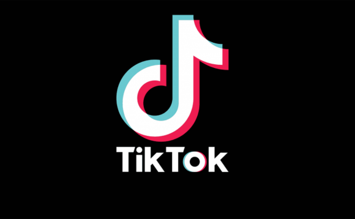
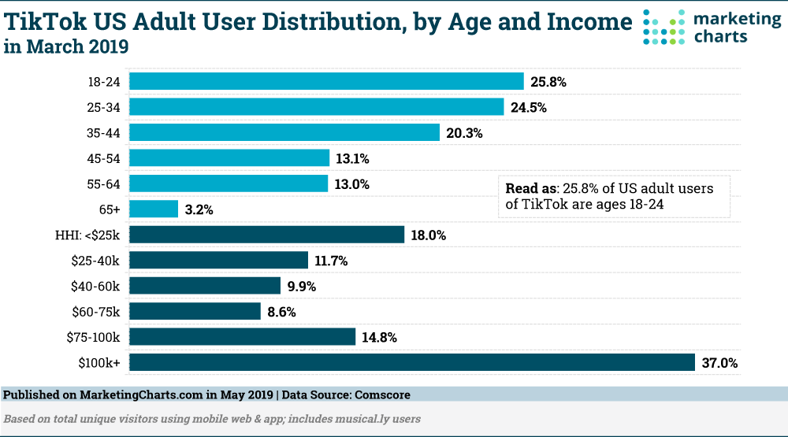
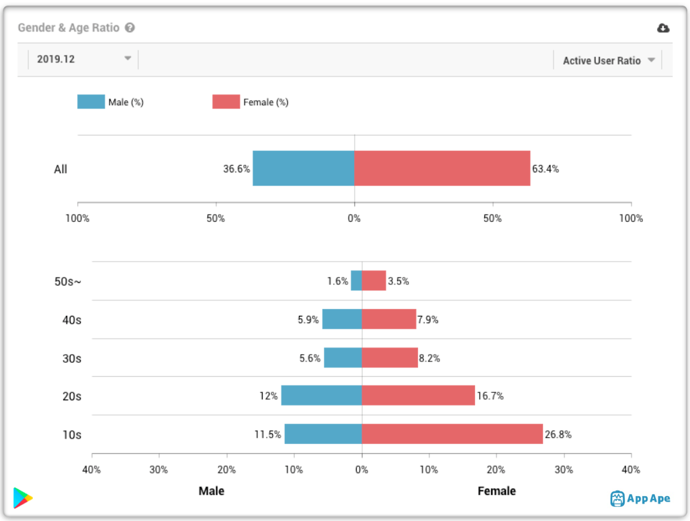
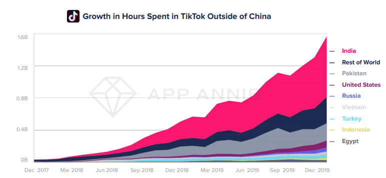

```{r setup, include=FALSE}
knitr::opts_chunk$set(echo = TRUE)
```


# What is TikTok?

TikTok is a social media app that allows users to seamlessly create and watch short, 5s to 15s, videos, always accompanied by music. With a focus on music accompaniment, TikTok has separated itself from previous short clip apps such as Vine.

# Scenario Design
### Target Users

TikTok is clearly aimed at younger people, specifically teens, as can be seen in the graph below^1^. Additionally, the same graph indicates that a high proportion of TikTok users have a household income above $100,000. What cannot be seen in this graph though is the recent trend of older people (above 25 years of age) downloaded the app. Especially with the recent quarantine, more people in different age bands have been downloading the app and joining in^4^.
  

The TikTok userbase in the United States is also predominantly female, as can be seen in the graph below^1^. This should have a large impact on the advertising and marketing of TikTok, especially with the weight of the one-sidedness of the userbase.
  

The last critical userbase to examine for TikTok is by location. Oustide of China, there has been strong growth in users in India, Pakistan, and the United States^1^. Not only are India and the United States large countries, they also have large economies that could prove crucial to the overall growth and lasting power of a social app such as TikTok.  
  

### Key Goals

The key goal for TikTok is to become the primary social app of the current generation. TikTok has taken many steps to increase the size of their userbase and overall footprint. They have impoyed cold starts, manual content curation, AI deployment, and promotion of mimicry^3^ to create an extremely simple and easy to use/enjoy social sharing app.

### How to Accomplsh Goals

TikTok has set about becoming the primary social app through curated videos and ease of use. Since you don't need to follow a user to see videos or gain access (known as a cold start^3^), users are able to jump right in without setting up much of a profile or working to find content they might enjoy. TikTok also employs an easy to use navigation system for accessing content. Users rarely pick out the videos they want to see, instead relying on an AI to provide them with an endless stream of fullscreen videos that the user can swipe through. As soon as the user is bored with a video or wants to move on, they simply seipe up and the AI generates the next video.

# Reverse Engineer the System

As alluded to by Forbes^2^, the TikTok recommender system makes heavy use of AI. This AI is fitted with computer vision and has the job of measuring user engagement with a video. When a user spends time watching a video, likes the video, shares the video, or otherwise interacts with the video or creator, the AI takes note. If a video is deemed to be highly engaging, the AI sends the content to more users, continuing this process over and over again. This allows videos to live and die purely by the engagement of the audience rather than the name of the content provider.  

This AI process is combined with an intial step of manual curation in which an operations team reviews the video for integrity and creativity^3^ before pushing it out for a first pass. The inital targeting is done via an AI which sends the video to the discovery feed of users that have shown an indication they may like the content posted (most likely through a nearest neighbor or random forest).  

TikTok has a slightly different system for recommending content creators to follow. According to Vox^5^, TikTok most likely employs automatic featurization in which "signals" from a profile picture are categorized and used as markers or attributes to look for when recommending content creators to follow. This system, however, has been subject to a high level of scrutiny as potentially rasict, since it tends to suggest content creators that look similar to each other.

# My Recommendations

TikTok has pretty much everything figured out. They are one of the fastest growing apps in the world and are trailing in most categories only to Facebook and their suite of apps^1^. However, if there was anything I would change about TikTok recommendations, I would elimate the recommendations of content creators to follow altogether. This is a widely unused portion of the app^3^ and has opened TikTok up to a high level of scrutiny and criticism over what may appear as racism. Since the feature is often unused and it is highly vulnerable to criticism, it makes no sense to keep it around.

# Citations

1. “TikTok Revenue and Usage Statistics (2020).” *Business of Apps*, 9 Apr. 2020, www.businessofapps.com/data/tik-tok-statistics/.  
2. Marr, Bernard. “AI In China: How Buzzfeed Rival ByteDance Uses Machine Learning To Revolutionize The News.” *Forbes*, Forbes Magazine, 7 Mar. 2019, www.forbes.com/sites/bernardmarr/2018/12/05/ai-in-china-how-buzzfeed-rival-bytedance-uses-machine-learning-to-revolutionize-the-news/#2c23a62140db.  
3. Wang, Sean. “A Close Look into Tik Tok.” *Medium*, Medium, 15 May 2018, medium.com/@seanzhiyangwangsk/a-look-into-tik-toks-success-6c12ebae572c.  
4. *The New York Times*, The New York Times, static.nytimes.com/email-content/LI_sample.html?action=click&module=nl-index-see-the-latest.  
5. Heilweil, Rebecca. “There's Something Strange about TikTok Recommendations.” *Vox*, Vox, 25 Feb. 2020, www.vox.com/recode/2020/2/25/21152585/tiktok-recommendations-profile-look-alike.